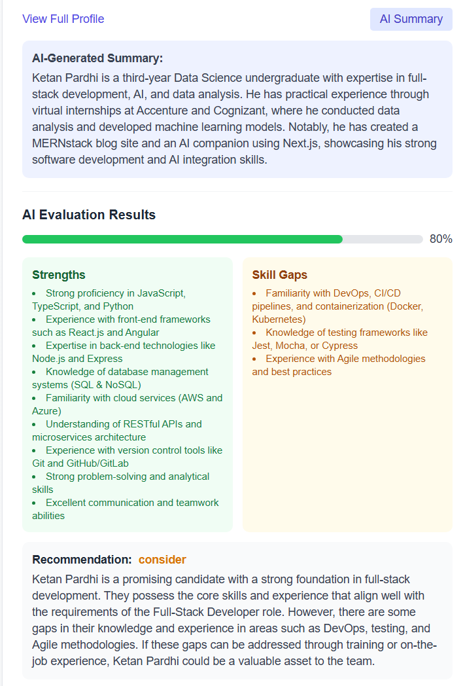

# HiringBud

HiringBud is an AI-powered hiring assistant that leverages Google Gemini API and Retrieval-Augmented Generation (RAG) to streamline the candidate evaluation process.

## Overview

HiringBud simplifies and enhances the recruitment process by automatically parsing resumes, matching candidates with job descriptions, and providing AI-powered evaluations. The application helps recruiters quickly identify the most suitable candidates for their positions based on skills, experience, and qualifications.





## Features

- **Resume Parsing**: Extract text and structured information from PDF resumes
- **Candidate Application Form**: User-friendly interface for candidate submissions
- **Vector Search**: Store and retrieve candidate profiles using semantic search
- **AI-Powered Evaluation**:
  - Resume summarization
  - Candidate-job description matching
  - Skills gap analysis
  - Automated scoring and recommendations

## Tech Stack

- **Frontend**: Next.js, React, Tailwind CSS
- **Backend**: Next.js API Routes
- **AI & ML**:
  - Google Gemini API for natural language processing
  - Vector embeddings for semantic search
- **Vector Database**: Pinecone
- **PDF Processing**: pdf-parse
- **Data Storage**: Local file system / Pinecone vector database

## Getting Started

### Prerequisites

- Node.js v16+ and npm
- Google Gemini API key
- Pinecone account and API key

### Installation

1. Clone the repository:
   ```sh
   git clone <repository-url>
   ```
2. Install dependencies:
   ```sh
   npm install
   ```
3. Create a `.env` file in the project root with the following variables:
   ```env
   GOOGLE_GEMINI_API_KEY=your_google_gemini_api_key
   PINECONE_API_KEY=your_pinecone_api_key
   ```
4. Start the development server:
   ```sh
   npm run dev
   ```
5. Open [http://localhost:3000](http://localhost:3000) in your browser to access HiringBud.

## Usage Guide

### Adding Job Descriptions

1. Navigate to the "Job Descriptions" page
2. Click "Add New Job Description"
3. Fill in the job details and requirements
4. Submit to add to the database

### Candidate Application

1. Share the application URL with candidates
2. Candidates complete the form and upload their resume
3. System automatically parses and processes the resume

### Candidate Evaluation

1. Go to the "Candidate Search" page
2. Enter a job description or select an existing one
3. View matching candidates ranked by relevance
4. Click "Generate Summary" to get an AI-powered candidate profile
5. Click "Evaluate Fit" to see detailed candidate-job matching analysis

## Project Structure

### Implementation Details

#### Resume Parsing

The application uses pdf-parse to extract text from PDF resumes. The parsed text is then processed to identify key sections (education, experience, skills) using regular expressions and heuristics.

#### RAG Implementation

- **Embedding Generation**: Resume text is converted into vector embeddings
- **Vector Storage**: Embeddings are stored in Pinecone with candidate metadata
- **Semantic Search**: Job descriptions are converted to vectors and used for similarity search
- **Result Enhancement**: Top matches are retrieved and enhanced with AI-generated insights

#### Google Gemini Integration

The Gemini API is used for:
- **Summarization**: Condensing lengthy resumes into concise profiles
- **Evaluation**: Comparing candidate profiles with job requirements
- **Feedback Generation**: Providing insights on skills gaps and candidate suitability

## Future Improvements

- OCR capability for scanned resumes
- Multi-language support
- Interview question generation based on candidate profiles
- Advanced analytics dashboard for recruitment metrics
- Integration with ATS systems

## License

MIT

## Acknowledgements

- Google Gemini AI
- Pinecone Vector Database
- Next.js
- pdf-parse
